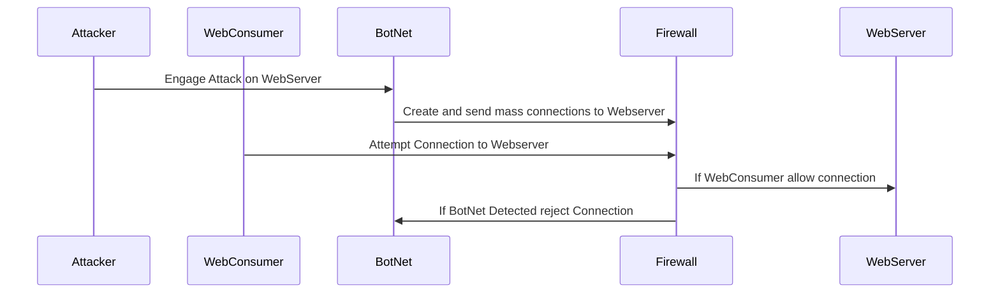

```mermaid
sequenceDiagram
    participant Attacker
    participant WebConsumer
    participant BotNet
    participant Firewall
    participant WebServer
    Attacker->>BotNet:Engage Attack on WebServer
    BotNet->>Firewall:Create and send mass connections to Webserver
    WebConsumer->>Firewall:Attempt Connection to Webserver
    Firewall->>WebServer:If WebConsumer allow connection
    Firewall->>BotNet:If BotNet Detected reject Connection
```
