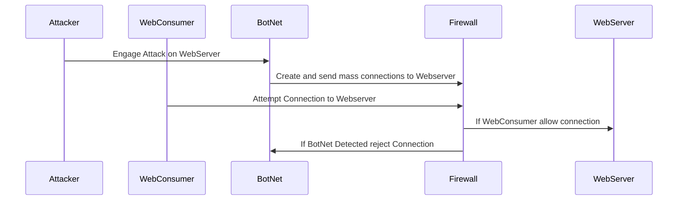

##DDOS Sequence
An attacker will utilize a Bot Net already created to disrupt service on a particular website 

* That attacker will tell the botnet to send multiple connection requests to a specific website or service
* The BotNet will attempt to connect multiple times at the same instant to overwhelm the site or service
* The Firewall will filter all the data incoming to the site or server for malicious intent and reject those it deems bad

